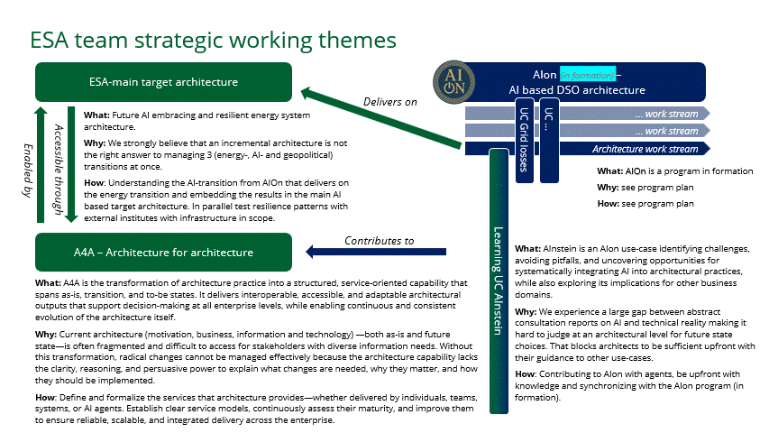

# AInstein - Artifacts

[](https://www.alliander.com)

A comprehensive repository for AInstein artifacts supporting AI-enabled architecture capabilities at Alliander. This repository hosts development artifacts and additional enabling architecture materials that empower the Energy System Architects (ESA) group to deliver tailored architecture-related answers to various stakeholders through AI-augmented human-in-the-loop principles.

## 📋 Table of Contents

- [About](#about)
- [What is AInstein?](#what-is-ainstein)
- [Repository Purpose](#repository-purpose)
- [Repository Structure](#repository-structure)
- [Getting Started](#getting-started)
- [Goals and Objectives](#goals-and-objectives)
- [Contributing](#contributing)
- [Governance](#governance)
- [Related Initiatives and Repositories](#related-initiatives-and-repositories)
- [Contact](#contact)

## About

This repository is maintained by the **Energy System Architects (ESA)** group at Alliander and serves as the central location for AInstein artifacts that enable AI-augmented architecture capabilities.

**Repository Naming Convention:**
- **esa**: Energy System Architects group (owning group)
- **ainstein**: AInstein initiative (Learning UC Alinstein)
- **artifacts**: Development and enabling architecture materials (content type)

## What is AInstein?



**AInstein (Learning UC Alinstein)** is an AIon use-case focused on systematically integrating AI into architectural practices while exploring its implications for other business domains.

**What**: AInstein is an AIon use-case identifying challenges, avoiding pitfalls, and uncovering opportunities for systematically integrating AI into architectural practices, while also exploring its implications for other business domains.

**Why**: We experience a large gap between abstract consultation reports on AI and technical reality, making it hard to judge at an architectural level for future state choices. That blocks architects from being sufficient upfront with their guidance to other use-cases.

**How**: Contributing to AIon with agents, be upfront with knowledge and synchronizing with the AIon program (in formation).

AInstein serves as a critical learning platform that bridges the gap between abstract AI concepts and practical architectural implementation, providing concrete patterns and insights that inform broader organizational AI adoption.

## Repository Purpose

This repository empowers architecture groups (currently limited to ESA) to provide architecture insights that are:

- **Tailored**: Customized to different types of stakeholders and their specific information needs
- **Knowledge-based**: Built on shared and common architectural knowledge
- **Human-supervised**: Delivered with human oversight and involvement through human-in-the-loop principles
- **Context-aware**: Adaptable to different organizational contexts and evolving structures

As a result, stakeholders will be positively surprised by:
- The effectiveness of communication around their topics
- The relevance and precision of the deliverables
- The impact of the architecture team's output

### Key Capabilities

1. **AI-Augmented Architecture Services**: Leveraging AI agents to enhance architecture delivery
2. **Knowledge Management**: Maintaining and curating shared architectural knowledge
3. **Stakeholder-Specific Communication**: Enabling tailored responses to diverse stakeholder needs
4. **Learning and Experimentation**: Testing AI integration patterns and uncovering opportunities and pitfalls

## Repository Structure

```
esa-ainstein-artifacts/
├── agents/                  # AI agent configurations and specifications
│   ├── prompts/            # Agent prompt templates and instructions
│   └── workflows/          # Agent workflow definitions
├── knowledge/              # Shared architectural knowledge base
│   ├── documents/          # Architecture documents and references
│   ├── models/             # Architecture models and diagrams
│   └── patterns/           # Architectural patterns and best practices
├── experiments/            # AI integration experiments and learnings
│   ├── use-cases/          # Specific use case implementations
│   └── evaluations/        # Experiment results and evaluations
├── deliverables/           # Stakeholder-specific outputs
│   └── templates/          # Reusable delivery templates
├── docs/                   # Documentation and resources
│   └── images/             # Diagrams, screenshots, and visual assets
└── README.md               # This file
```

## Getting Started

### Prerequisites

- Access to Alliander internal systems
- Understanding of enterprise architecture principles
- Familiarity with the ESA initiatives ecosystem (ESA-main, AIon, A4A)
- Basic understanding of AI/LLM capabilities and limitations
- Commitment to human-in-the-loop principles

### Installation

```bash
# Clone the repository
git clone https://github.com/Alliander/esa-ainstein-artifacts.git

cd esa-ainstein-artifacts
```

### Usage

Browse the repository structure to find relevant artifacts:

- **For AI agent configurations**: Check the `agents/` directory
- **For shared knowledge**: See the `knowledge/` directory
- **For experiments and learnings**: Browse the `experiments/` directory
- **For stakeholder deliverables**: Use files within the `deliverables/` directory
- **For documentation**: Explore the `docs/` directory

## Goals and Objectives

### General Goals

1. **Enable Stakeholder-Specific Architecture Delivery**: Empower ESA groups to answer architecture-related topics in a manner tailored to each stakeholder type
2. **Maintain Human Oversight**: Ensure human involvement and judgment while leveraging shared knowledge and AI capabilities
3. **Improve Engagement**: Enhance stakeholder engagement and satisfaction through personalized, effective communication
4. **Bridge Theory and Practice**: Close the gap between abstract AI consultation reports and technical architectural reality

### Architecture Group Goals

**Efficiency Improvement**
- Create time in the team by improving efficiency
- Avoid unnecessary stakeholder management through one-time-hit communication
- Leverage AI to handle routine inquiries and information synthesis

**Contextual Flexibility**
- Enable answering the same content in different contexts (e.g., transitioning from departmental to chain-based organization)
- Adapt communication style and depth to stakeholder needs
- Support organizational transformation through flexible architecture delivery

**Enhanced Impact**
- Create more impact with architecture through better and tailor-made deliverables
- Demonstrate architecture value through relevant, timely insights
- Build trust through consistent, high-quality outputs

**Data Control and Learning**
- Start learning from a point where we are in control of the data itself (e.g., architecture files and related artifacts)
- Build organizational knowledge assets that improve over time
- Understand AI capabilities and limitations through practical experimentation

### Learning Objectives

**For the Organization**
- Identify challenges in systematically integrating AI into architectural practices
- Avoid common pitfalls in AI adoption through documented learnings
- Uncover opportunities for AI to enhance architecture delivery and impact

**For Other Use Cases**
- Provide upfront guidance to other business domains considering AI integration
- Share patterns and anti-patterns learned from AInstein experiments
- Enable informed decision-making about AI adoption across the enterprise

## Contributing

We welcome contributions from the ESA team and other Alliander colleagues actively wishing to contribute. Please:

1. Create a feature branch (`git checkout -b feature/new-agent` or `git checkout -b feature/experiment`)
2. Add your artifacts with clear naming conventions
3. Document your contributions, especially learnings from experiments
4. Update relevant documentation
5. Commit your changes (`git commit -am 'Add [artifact description]'`)
6. Push to the branch (`git push origin feature/new-agent`)
7. Create a Pull Request

### Contribution Guidelines

**General Guidelines:**
- Follow human-in-the-loop principles in all AI-related work
- Document both successes and failures from experiments
- Ensure sensitive information is not included in artifacts
- Update this README if adding new categories or major changes
- Maintain data control and privacy standards

**For Agent Configurations:**
- Clearly document agent capabilities and limitations
- Include prompt engineering best practices
- Test agent outputs with human review
- Version control prompt changes

**For Knowledge Base:**
- Ensure accuracy and currency of architectural knowledge
- Link to authoritative sources where applicable
- Maintain consistent formatting and organization
- Tag content for easy retrieval

**For Experiments:**
- Document hypotheses and expected outcomes
- Record actual results and learnings
- Identify patterns, opportunities, and pitfalls
- Share insights that benefit other use cases

### Artifact Naming Conventions 

```
[YYYY-MM-DD]_[artifact-type]_[description].[extension]

Examples:
2025-11-20_agent-config_stakeholder-communication.yaml
2025-11-20_experiment_architecture-q-and-a.md
2025-11-20_knowledge_archimate-patterns.md
2025-11-20_deliverable_executive-briefing-template.md
```

## Governance

**Current Governance:**
Governance is currently limited to the ESA group and any architects or contributors actively wishing to contribute. This ensures focused experimentation and learning during the initiative's formative phase.

**Governance Principles:**
- Human-in-the-loop oversight for all AI-generated outputs
- Data control and privacy protection
- Collaborative decision-making within the ESA group
- Transparent sharing of learnings and insights
- Alignment with broader AIon program objectives

**Future Governance:**
Upon delivery and maturation of AInstein capabilities, governance will be updated to reflect broader participation and oversight across the organization. This may include:
- Expanded stakeholder participation
- Formalized review and approval processes
- Integration with enterprise AI governance frameworks
- Broader knowledge sharing mechanisms

## Related Initiatives and Repositories

As shown by the ESA Initiatives figure under the "What is AInstein?" section, AInstein initiative is part of the broader ecosystem of ESA strategic working themes:

- **ESA-main Target Architecture**
- **Architecture for Architecture (A4A)**
- **AIon**

These tightly-coupled ESA architecture initiatives have their own repositories and these repositories work together to provide a complete view of the Energy System Architecture delivery streams:

- **[esa-ainstein-artifacts](https://github.com/Alliander/esa-ainstein-artifacts)** - AInstein artifacts and knowledge base (this repository)
- **[esa-ainstein-archi](https://github.com/Alliander/esa-ainstein-archi)** - AInstein ArchiMate co-architecture models
- **[esa-main-artifacts](https://github.com/Alliander/esa-main-artifacts)** - ESA-main target architecture artifacts, ADRs, and principles
- **[esa-a4a-artifacts](https://github.com/Alliander/esa-a4a-artifacts)** - A4A general artifacts and documentation
- **[esa-a4a-archi](https://github.com/Alliander/esa-a4a-archi)** - A4A ArchiMate co-architecture models
- **[esa-aion-artifacts](https://github.com/Alliander/esa-aion-artifacts)** - AIon artifacts and knowledge base
- **[esa-aion-archi](https://github.com/Alliander/esa-aion-archi)** - AIon ArchiMate co-architecture models

## Related Resources

### Architecture Frameworks & Standards

- **[TOGAF Standard, 10th Edition](https://www.opengroup.org/togaf)** - The Open Group Architecture Framework (latest version, released 2022, updated 2025)
- **[ArchiMate 3.2 Specification](https://pubs.opengroup.org/architecture/archimate3-doc/)** - Official ArchiMate 3.2 specification (current version)
- **[ArchiMate Forum](https://www.opengroup.org/archimate-forum)** - The Open Group ArchiMate community

### Tools

- **[Archi](https://www.archimatetool.com/)** - Free, open-source ArchiMate modeling tool (v5.6.0+, supports ArchiMate 3.2)
- **[Archi Downloads](https://www.archimatetool.com/download/)** - Download the latest version
- **[Archi Resources](https://www.archimatetool.com/resources/)** - Additional learning materials and examples
- **[coArchi Plugin](https://www.archimatetool.com/plugins/)** - Collaboration plugin for Archi

### Learning Materials

- **[Introduction to TOGAF 10 White Paper](https://www.opengroup.org/togaf/new-version)** - What's new in TOGAF Standard, 10th Edition
- **[ArchiMate 3.2 Overview](https://www.opengroup.org/archimate-forum/archimate-overview)** - Introduction to ArchiMate 3.2
- **[TOGAF Library](https://www.opengroup.org/togaf-standard-10th-edition-downloads)** - Downloadable TOGAF documentation
- **[Mastering ArchiMate](https://www.amazon.com/Mastering-ArchiMate-Gerben-Wierda/dp/9401800014)** - Comprehensive book by Gerben Wierda

### AI Architecture, Ethiscs and Governance

- **[AI in Enterprise Architecture](https://www.opengroup.org/ai-in-enterprise-architecture)** - The Open Group resources on AI in EA
- **[Modeling AI Systems with ArchiMate](https://bizzdesign.com/blog/modeling-ai-systems/)** - Guidance on representing AI in ArchiMate
- **[EU AI Act](https://www.europarl.europa.eu/topics/en/article/20230601STO93804/eu-ai-act-first-regulation-on-artificial-intelligence)** - European Union's AI regulatory framework. The world’s first comprehensive AI law
- **[OECD AI Principles](https://oecd.ai/en/ai-principles)** - International AI governance principles

### Energy System Architecture

- **[IEC 61968 Series](https://webstore.iec.ch/publication/6195)** - Application integration at electric utilities - System interfaces for distribution management
- **[IEC 62351 Series](https://webstore.iec.ch/publication/6912)** - Power systems management and associated information exchange - Data and communications security
- **[SGAM (Smart Grid Architecture Model)](https://ec.europa.eu/energy/sites/ener/files/doc

## Contact

**Energy System Architects (ESA) Team**
- Organization: [Alliander](https://www.alliander.com)
- Repository: [esa-ainstein-artifacts](https://github.com/Alliander/esa-ainstein-artifacts)

For questions or support, please [open an issue](https://github.com/Alliander/esa-ainstein-artifacts/issues) or contact the ESA team.

---

*[Maintained by the ESA team at Alliander](https://www.alliander.com/en/)*
