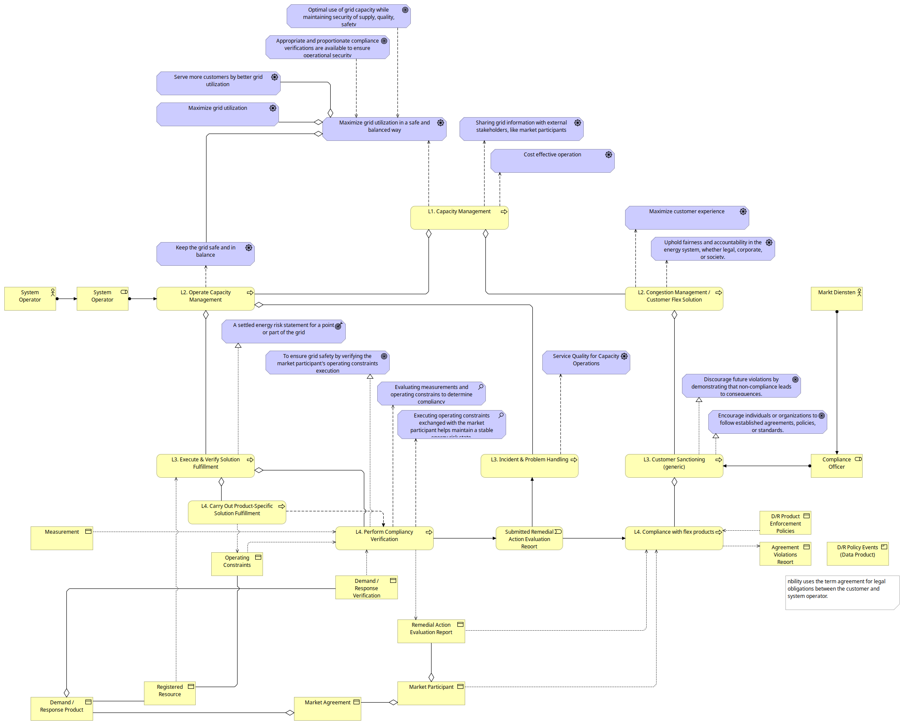

---
# Configuration for the Jekyll template "Just the Docs"
#@prefix dct: <http://purl.org/dc/terms>
nav_order: ADR.20D
dct:
  identifier: urn:uuid:a7b8c9d0-e1f2-4a3b-4c5d-6e7f8a9b0c1d
  title: Verify demand response products
---

# Decision Approval Record List

## 1. Creation and ESA Approval of ADR.20

| Name                    | Value                                                |
|-------------------------|------------------------------------------------------|
| Version of ADR          | v1.0.0 (2025-04-09)                                  |
| Decision                | Accepted                                             |
| Decision date           | 2025-02-28                                           |
| Driver (Decision owner) | System Operations - Energy System Architecture Group |
| Remarks                 | Decision made with approval of management BBN and SO |

**Approvers**

| Name              | Email                           | Role                    | Comments |
|-------------------|---------------------------------|-------------------------|----------|
| Robert-Jan Peters | robert-jan.peters@alliander.com | Energy System Architect |
| Arjan Stam        | arjan.stam@alliander.com        | Director BBN and SO     |          |
| Peter Wessels     | peter.wessels@alliander.com     | Product Manager SO      |          |

**Informed**
| Name | Email | Role | Comments |
|------|-------|------|----------|
| Mitchel Haeve | mitchel.haeve@allianderc.om | Epic Owner System Operations  |          |
| René Tiesma   | rene.tiesma@alliander.com   | Energy System Architect - BBN |          |

**Additional Notes**
The ArchiMate drawing highlights the motivation and business elements that support this decision, showing how the
drivers, goals, and principles align with the business process constraints that must be verified. 

