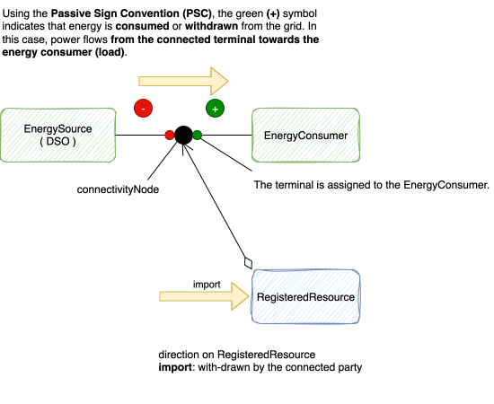
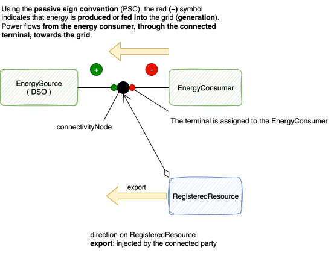

---
# Configuration for the Jekyll template "Just the Docs"
parent: Decisions
nav_order: 24
title: Use standard for specifying the energy flow direction in the market domain
status: proposed
date: 2025-09-23

driver: Robert-Jan.Peters <robert-jan.peters@alliander.com>
#approvers: list everyone with the final say in this ADR.
contributors: Kevin van der Bekerom <kevin.van.den.bekerom@alliander.com>,
  Tosca de Jong <tosca.de.jong@alliander.com>, Hans Harts <hans.harts@alliander.com>,
  Paul Wassenberg <paul.wassenberg@alliander.com>, Gijs te Brake <gijs.te.brake@alliander.com>,
  Laurent van Groningen <laurent.van.groningen@alliander.com>
#informed: list every one who need to be aware of the decision once made. 

# These are optional elements. Feel free to remove any of them.
# additional decision-makers: {list everyone involved in the decision}
---

<!-- markdownlint-disable-next-line MD025 -->

# Use standard for specifying the energy flow direction in the market domain

## Context and Problem Statement

In electricity markets, the accurate exchange of information between market participants—such as producers, suppliers,
traders, aggregators, and system operators—is essential for both operational coordination and financial settlement. A
core aspect of this exchange is the explicit indicator of an energy flow direction.

This applies in various contexts, including:

* Day-ahead and intraday schedules
* Bilateral trade nominations
* Metered data reporting
* Imbalance settlement
* Capacity allocation and congestion management

However, different systems, market platforms, or data standards may adopt inconsistent conventions for representing the
direction of energy flow—some may interpret positive values as injection (export to grid), while others as withdrawal (
import from grid).

This creates risks of misinterpretation, mismatched schedules, or incorrect financial settlements.

In addition, when data is exchanged between different roles (e.g., between BRPs and TSOs), the need for a shared
convention or clear metadata about the directionality becomes even more critical.

## Decision Drivers

The following drivers are key factors that influence and justify the architectural decision process.

* Enable market participants (e.g., Balance Response Parties, Charge Point Operators, Distributed System Operator, new
  entrants) to participate in congestion management and energy balancing (obtained from the main EU regulations:
  2017/2195, 2019/943, 2015/1222)
* Ensure data integrity across all system interfaces to prevent data corruption, loss, or unauthorized modifications
  that could impact operational decisions and grid stability.
* Ensure consistent interpretation of energy-related concepts preventing misinterpretations of directionality,
  especially in multivendor and multi-domain environments, to align on a common indication on the physical flow.
* Ensure consistency in the use of standardized role codes and domain direction qualifiers across systems and
  implementations.
* Ensure energy system reliability and stability to support secure, uninterrupted power delivery and maintain grid
  integrity under all operating conditions.
* Alignment with grid calculation methods, as misalignment can cause incorrect load/generation interpretation or
  simulation errors.

## Considered Options

* IEC 62325-451 is a standard for energy market communications to facilitate interoperability and standardized data
  exchange
  in deregulated energy markets and ENTSO-E implementation guides.
* Signed Quantities, where some systems represent a direction implicitly by the sign of the quantity.
  This avoids a separate attribute but can be less explicit and may introduce confusion if not consistently applied (
  e.g., positive = export vs. positive = import).
* Market roles (Party Connected to the Grid, Flexibility Service Provider) may use different reference points for
  directionality. Alliander Specific, using the directions as LDN (Levering door Net) or ODN (Ontvangen door Net). The
  role determines the direction by whether the sending party is the system operator.

## Decision Outcome

The system will adopt the directionality model as defined in the IEC 62325-451 series of message profiles (as
implemented by ENTSO-E), to ensure consistent representation of energy flow across market communication scenarios.

## Pros and Cons of the Options

* Consistent with the Passive Sign Convention

This decision is consistent with the [passive sign convention](0021-use-sign-convention-for-current-direction.md) and
generation in load flow calculations are represented by the EnergyConsumer. The energy flow direction (import / export)
uses the view from each market participant. Having both ADR's lead to:

- market participant import results to a positive sign from a load flow viewpoint.
- market participant export results to a negative sign from a load flow viewpoint.

As depicted in the following illustrations:

* Import<br>
  Energy is said to be imported when it flows from the transmission or distribution grid to a market participant or
  control area.<br>
  In physical terms, import = withdrawal from the grid.<br>
  


* Export<br>
  Energy is said to be exported when it flows from a market participant or control area into the transmission or
  distribution grid, or from one control area to another.<br>
  In physical terms, export = injection into the grid. <br>

  

* Supports unambiguous interpretation by all market participants.
* Simplifies validation and integration across systems using standard profiles
* This makes alignment with the internal business domain models possible.

### Consequences

**Note 1:** 
The applicability of this decision is on the interface only and can be verbal, written, or automated.

* The design decision impacts the following systems: 
  * Future systems: must adopt this architectural decision from the outset.
  * Legacy systems: remain unchanged unless proactive updates are required.
* Market interaction: Always apply this architectural decision in processes and exchanges with market participants.
* Clarification of perspective: The current Alliander convention for an energy direction (infeed = ODN, opname door net;
  consumption = LDN, levering door netbeheerder) is based on the DSO’s viewpoint, not the market participants’
  viewpoint. This distinction must be made explicit.
* Semantic validation: This design decision must be verified in both personal and automated communication.
* Grid calculation: This design is aligned with the passive sign convention used in grid calculations, like powerflow
  and state estimation.
* Documentation alignment: All related documentation and data models must be updated to reflect this architectural
  decision.
* Standard compliance: Systems must map and validate energy direction values in line with the IEC 62325 enumerations.


## Links

* Related ADRs:
    * [ADR‑0011 Use standard for describing business functions](0011-use-standard-for-business-functions.md)
    * [ADR‑0021 Use sign convention for current direction](0021-use-sign-convention-for-current-direction.md)

## More Information

### The information model

The model of an import/export direction using the `direction` attribute as defined in IEC 62325-451 message profiles.
The attribute is typically an enumeration (e.g. "import" or "export") and is associated with relevant business objects
such as `TimeSeries`, or `Point`.

However, the meaning of import vs export is relative — for example:

- For TSOs/DSOs, import/export might be from the grid's perspective.
- For market participants, it’s usually from the participant’s viewpoint.

To avoid ambiguity, you want to make the attribute name reflect that the direction is from the market participant’s
perspective. When implementing direction attributes in market domain systems:

- To ensure clarity, name attributes to reflect the market participant's perspective
- For IEC 62325 standard compliance while maintaining an explicit viewpoint:
    1. Keep the original `direction` attribute
    2. Add a companion `directionViewpoint` attribute

```json
{
  "direction": "import",
  "directionViewpoint": "marketParticipant"
}
```

This approach maintains standard compliance while removing ambiguity about the direction's reference point.

### Energy Flow Representation (the passive sign convention)

A graphical representation of energy flow for a market participant follows the passive sign convention:

- X-axis → time
- Y-axis → energy value
- Positive Y → import = energy to the participant (consumer role)
- Negative Y → export = energy from the participant (producer role)

Thus, conform this convention: positive = import, negative = export.

### Reference

* [Flow direction in the Market Domain](https://alliander.atlassian.net/wiki/x/BwKnxQ)
* IEC 62325-351:2016 – Framework for energy market communications
* IEC 62325-451 series – Specific profiles for European market
* [ENTSO-E CIM Library](https://www.entsoe.eu/digital/cim/cim-library/)
